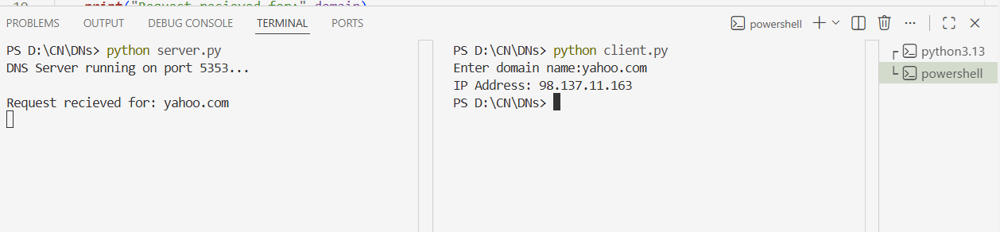

# 6_Simulating_DNS_using_UDP_sockets
## AIM: 
The aim of simulating DNS using UDP sockets is to create a basic DNS server that can receive DNS queries over UDP and respond with the appropriate IP address for a given domain. In this simulation, we're simplifying DNS functionality, focusing on basic domain-to-IP mapping and handling simple queries.
## ALGORITHM 
1.Initialize DNS Server:
<BR>
Create a UDP socket to handle communication.
Bind the socket to a specific IP address and port to listen for incoming DNS queries.
<BR>
2.Define DNS Server Configuration:
<BR>
Set the DNS server IP address and port.
Prepare a mapping of domain names to corresponding IP addresses.
<BR>
3.Listen for DNS Queries:
<BR>
Enter a loop to continuously listen for incoming UDP messages.
Receive DNS Query:
When a DNS query is received, extract the domain name from the received data.
<BR>
4.Check Domain-to-IP Mapping:
Check if the received domain name exists in the predefined mapping.
If it does, retrieve the corresponding IP address.
If it doesn't, prepare an error response.
<BR>
5.Send DNS Response:
<BR>
If the domain is found, send the IP address back to the client.
If the domain is not found, send an error response.
<BR>
6.Handle Multiple Requests:
<BR>
The server remains in the listening state to handle multiple DNS queries.
Close the Server:
Optionally, include a mechanism to gracefully close the server when needed.
<BR>
## PROGRAM
## Server.py
```
import socket 
#dns records(simulated database)
dns_table={
    "google.com":"142.250.190.78",
    "yahoo.com":"98.137.11.163",
    "openai.com":"104.18.12.123",
    "example.com":"93.184.216.34"
}
#create udp socket
server_socket=socket.socket(socket.AF_INET,socket.SOCK_DGRAM)
#bind server to localhost and port
server_socket.bind(("127.0.0.1",15353))
print("DNS Server running on port 5353...\n")

while True:
    #recieve domain request from client
    message,client_address=server_socket.recvfrom(1024)
    domain=message.decode()
    print("Request recieved for:",domain)
    #check dns table
    ip=dns_table.get(domain,"Domain not found")
    #send response back to client
    server_socket.sendto(ip.encode(),client_address)
```
## Client.py
```
import socket 
#create udp socket
client_socket = socket.socket(socket.AF_INET,socket.SOCK_DGRAM)
server_address=("127.0.0.1",15353)
#get domain name from user
domain=input("Enter domain name:")
#send request to server
client_socket.sendto(domain.encode(),server_address)
#recieve response
ip_address,server=client_socket.recvfrom(1024)
print("IP Address:",ip_address.decode())
client_socket.close()
```
## OUPUT

## RESULT
Thus the Experiment implemented sucessfully
